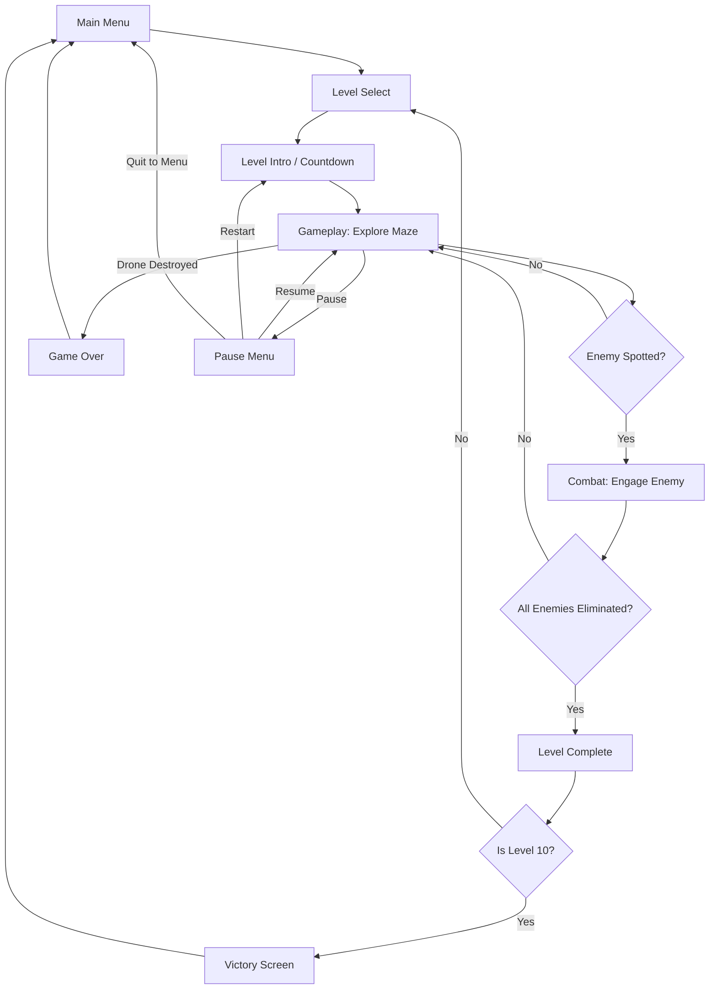
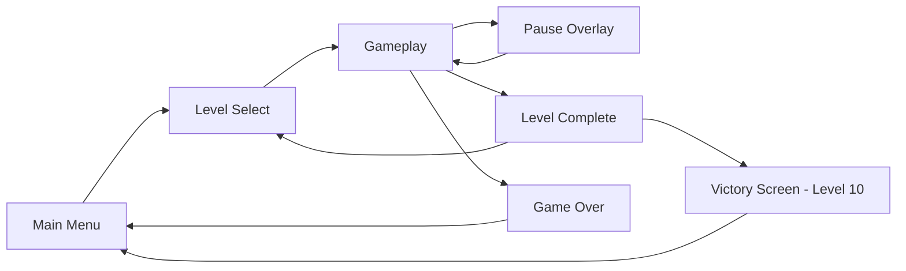
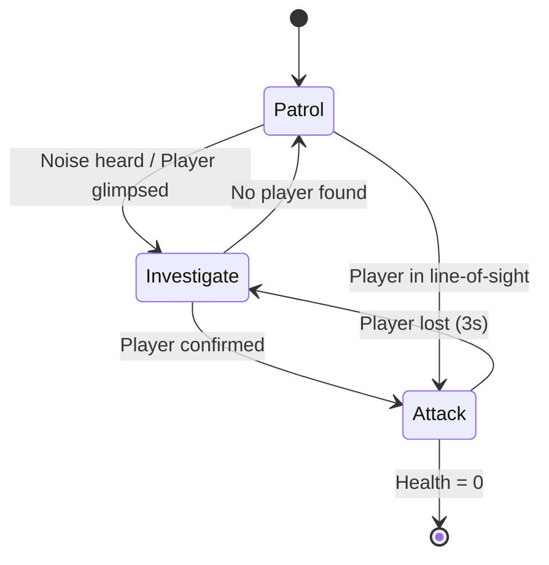

# MAZE STRIKE — Product Vision & User Experience Design Document

**Version:** 1.0  
**Status:** Single Source of Truth (SSOT)  
**Last Updated:** 2025-01-01

---

## 1. Product Vision & Executive Summary

### Elevator Pitch
**MAZE STRIKE** is a top-down third-person shooter where you pilot an advanced combat drone through a procedurally generated, high-tech military maze. Hunt down hostile mech units, scavenge powerful weapons, and fight colossal bosses across 10 escalating levels. Every visual element — from the neon-lit corridors to the muzzle flash of your plasma rifle — is rendered procedurally in real time.

### Core Design Goals & Value Proposition
1. **High-Frequency Combat Loop:** Instant feedback on every shot — muzzle flash, tracers, impacts, and screen shake — creating a visceral, satisfying gunplay experience.
2. **Tactical Search-and-Destroy Tension:** Enemies patrol and investigate; you must hunt them before they hunt you. Line-of-sight and alert systems create genuine stealth-and-strike moments.
3. **Procedural Replayability:** Every level is a new maze. No two runs are identical, encouraging repeated play.
4. **Premium Visual Polish:** Military base aesthetics fused with high-tech neon accents, dynamic lighting, and particle-rich effects — all achieved with procedural THREE.js primitives.

---

## 2. Core User Journey & Primary Workflow

### Core Loop Diagram

### Moment-to-Moment Gameplay Loop
1. **Spawn & Orient:** Player spawns at a safe room. HUD fades in. A brief 3-second countdown ("3... 2... 1... ENGAGE") plays.
2. **Explore:** Player navigates corridors and rooms using WASD/Arrows. The minimap reveals explored areas. Doors slide open as the drone approaches.
3. **Search:** Enemies patrol. The player uses sight and sound cues (enemy movement, searchlights) to locate them. The crosshair highlights enemies in view.
4. **Engage:** On sight, enemies enter attack state. The player fires weapons, dodges projectiles, and uses cover (crates, walls).
5. **Clear & Advance:** When all enemies are eliminated, a "LEVEL CLEAR" banner appears. The exit door unlocks, leading to the level complete screen.

### Primary User Stories
- **As a player,** I want to move my drone with the keyboard and aim with the mouse, so that I have precise control over movement and firing.
- **As a player,** I want to pick up different weapons, so that I can adapt my combat style to different enemy types.
- **As a player,** I want to see a minimap, so that I can navigate the maze and locate remaining enemies.
- **As a player,** I want clear feedback on damage and kills, so that I understand the state of combat at all times.
- **As a player,** I want to pause the game, so that I can take a break without losing progress.

---

## 3. Functional Feature Breakdown

### Feature Domain A: Navigation & Primary Controls

#### Movement & Aiming
- **Keyboard (WASD / Arrow Keys):** Controls the drone's movement direction relative to the camera (top-down). The drone moves in the pressed direction.
- **Mouse:** Controls the drone's facing/aiming direction. The drone smoothly rotates toward the mouse cursor position.
- **Movement Speed:** Base speed of 8 units/second. The drone has acceleration and deceleration for smooth feel.
- **Collision:** The drone collides with walls, doors, crates, and other solid objects. It cannot pass through them.
- **Rotation:** Smooth rotation with a turn rate of 10 radians/second, ensuring responsive but fluid aiming.

#### Camera
- **Fixed Top-Down Perspective:** The camera is positioned directly above the player, looking straight down. The view follows the player's position.
- **Camera Zoom:** Slight zoom-out when the player is in a large room, zoom-in in corridors, for better situational awareness.

### Feature Domain B: Core Combat Mechanics

#### Shooting
- **Trigger:** Left mouse click fires the current weapon. Holding the button fires continuously for automatic weapons.
- **Fire Rate:** Each weapon has a defined rounds-per-minute (RPM). The weapon cannot fire faster than its RPM.
- **Bullet Travel:** Bullets are fast projectiles (speed varies by weapon). They travel in a straight line from the drone's weapon mount toward the aim direction.
- **Hit Detection:** Raycast-based. On hit, the bullet applies damage to the target and triggers impact effects.
- **Recoil / Visual Kick:** The drone's weapon mount kicks back slightly on each shot. The camera adds a subtle shake for heavy weapons.

#### Weapon Pickups
- **Spawn:** Weapon pickups spawn in designated rooms (armory rooms) at level start. They are visible as floating holographic weapon models with a glowing outline.
- **Pickup Interaction:** The drone flies over the pickup to collect it. The weapon is added to the inventory.
- **Weapon Switching:** Press `1`–`6` or use the mouse wheel to cycle through owned weapons.
- **Ammo:** Each weapon has a magazine and reserve ammo. Ammo pickups (small glowing boxes) replenish reserve ammo. Reload is automatic when the magazine is empty (with a reload animation and sound cue via HUD text).

#### Enemy AI
- **Search State (Patrol):** Enemies patrol predefined waypoints within their assigned room or corridor. They have a sight cone (90 degrees, 15-unit range) and a hearing radius (10 units).
- **Investigation:** If an enemy hears a noise (gunfire, explosion) or sees the player, it enters an "Investigating" state, moving toward the last known position.
- **Attack State:** When the player is confirmed in line-of-sight, the enemy enters Attack state. It chases the player, fires its weapon (or melee attacks), and strafes to avoid incoming fire.
- **Alert Propagation:** When an enemy enters Attack state, nearby enemies within a 20-unit radius are alerted and also enter Attack state.
- **Health & Death:** Each enemy has health. When health reaches 0, the enemy explodes into particles and light, and is removed from the level.

#### Boss Fights
- **Arena:** Bosses are encountered in large, dedicated arena rooms with cover and open space.
- **Phases:** Each boss has 2–3 phases. Phase transitions occur at health thresholds (e.g., 66% and 33%). On transition, the boss performs a dramatic attack and changes its pattern.
- **Boss Health Bar:** A large health bar appears at the top of the screen during boss fights.

### Feature Domain C: Feedback Systems & View States

#### HUD Elements
- **Health/Armor:** Two bars in the bottom-left. Health (green) and Armor (blue). Armor absorbs damage before health.
- **Weapon Info:** Bottom-right. Shows weapon name, magazine ammo (large), and reserve ammo (small).
- **Enemy Counter:** Top-center-left. "ENEMIES REMAINING: X".
- **Level Indicator:** Top-center. "LEVEL 3 / 10".
- **Minimap:** Top-right corner. A small circular map showing explored areas, the player (white dot), enemies (red dots when in line-of-sight), and the exit (green arrow).
- **Crosshair:** Center of screen. Dynamic — expands when firing, contracts when idle.
- **Damage Vignette:** Red pulsing overlay on the screen edges when the drone takes damage.
- **Kill Feed:** Top-left. Brief text notifications: "ELIMINATED: SENTRY MK-II".
- **Boss Health Bar:** Top-center, large bar with boss name.

---

## 4. UX / UI Navigation & Screen State Flow

### Screen Descriptions

#### Main Menu
- **Title:** "MAZE STRIKE" (large, glowing cyan text with animated scanline effect).
- **Buttons:**
  - "START MISSION" — proceeds to Level Select.
  - "HOW TO PLAY" — opens a controls overlay.
  - "QUIT" — exits the game (desktop only).
- **Background:** Animated procedural maze with drifting fog and searchlights.

#### Level Select
- **Title:** "SELECT MISSION".
- **Grid:** 10 tiles in a 5x2 grid. Each tile shows "LEVEL 1" through "LEVEL 10".
- **States:**
  - **Unlocked:** Bright, glowing border. Clickable.
  - **Locked:** Dark, dimmed, with a lock icon. Not clickable.
- **Back Button:** "BACK TO MAIN MENU".

#### Pause Overlay
- **Title:** "PAUSED".
- **Buttons:**
  - "RESUME" — returns to gameplay.
  - "RESTART LEVEL" — restarts the current level.
  - "QUIT TO MENU" — returns to Main Menu.

#### Level Complete
- **Title:** "LEVEL CLEAR".
- **Stats:** "TIME: MM:SS", "ENEMIES DESTROYED: X/Y", "ACCURACY: XX%".
- **Buttons:**
  - "NEXT LEVEL" — proceeds to the next level (or Victory if level 10).
  - "LEVEL SELECT" — returns to Level Select.

#### Game Over
- **Title:** "DRONE DESTROYED".
- **Buttons:**
  - "RETRY LEVEL" — restarts the current level.
  - "MAIN MENU" — returns to Main Menu.

#### Victory Screen
- **Title:** "ALL HOSTILES ELIMINATED".
- **Subtitle:** "MISSION COMPLETE. ALL 10 LEVELS CLEARED."
- **Stats:** Total time, total enemies destroyed, total accuracy.
- **Button:** "BACK TO MAIN MENU".

---

## 5. Scope Boundaries & Constraints

### In-Scope (v1 Release)
- Procedural maze generation (rooms, doors, corridors) with random seed.
- 10 levels with scaling difficulty.
- 6 pickable weapons.
- 7 mech enemy types + 3 boss types with AI (search/attack states).
- Drone player character with keyboard + mouse controls.
- Rich bullet effects (muzzle flash, tracers, impacts, shell casings).
- Full HUD (health, ammo, minimap, enemy counter, kill feed, boss bar).
- Main menu, level select, pause, game over, level complete, victory screens.
- Level unlock progression (in-memory, resets on page reload).
- All graphics procedural (THREE.js primitives, materials, lights).

### Out-of-Scope (Strict Non-Goals)
- **NO external binary assets:** No .png, .jpg, .wav, .mp3, or any imported texture/audio files. Everything must be generated procedurally.
- **NO audio/sound effects or music:** The game is silent by design.
- **NO multiplayer or online features.**
- **NO backend, accounts, or cloud saves.**
- **NO controller/gamepad support:** Keyboard + mouse only.
- **NO story campaign, cutscenes, or dialogue.**
- **NO weapon crafting, upgrades, or persistent progression** beyond level unlocking.
- **NO procedural audio generation.**
- **NO level editor or user-generated content.**

---

## 6. Detailed Feature Specifications

### 6.1 Maze Generation
- **Rooms:** 6–10 rooms per level. Room sizes vary: small (8x8), medium (12x12), large (16x16). Rooms are placed non-overlapping on a grid.
- **Doors:** Each room has 1–4 doorways. Doors are initially closed and slide open when the player approaches within 3 units. Some doors are locked and require all enemies in the room to be eliminated.
- **Corridors:** Corridors (width 3 units) connect doorways between rooms. Corridors may have turns.
- **Random Seed:** Each level uses a random seed. The seed is displayed on the level intro screen.
- **Level Size Scaling:**
  - Levels 1–3: 6 rooms, small maze.
  - Levels 4–7: 8 rooms, medium maze.
  - Levels 8–10: 10 rooms, large maze.
- **Spawn Points:**
  - **Player:** Spawns in the starting room (marked with a green holographic pad).
  - **Enemies:** Spawn in rooms away from the player start. Bosses spawn in dedicated arena rooms.
  - **Weapons:** Spawn in armory rooms (marked with a cyan holographic pad).
  - **Exit:** The exit door is in the room farthest from the player start. It unlocks when all enemies are eliminated.

### 6.2 Weapon Types (6)

| # | Name | Visual Identity | Damage | Fire Rate (RPM) | Magazine | Reserve | Projectile Speed | Special Behavior |
|---|------|----------------|--------|-----------------|----------|---------|------------------|------------------|
| 1 | **M9 Sidearm** | Small silver pistol with orange glow | 15 | 300 | 12 | 48 | 60 u/s | Balanced starter weapon. |
| 2 | **Viper SMG** | Compact black SMG with cyan accents | 10 | 900 | 30 | 120 | 70 u/s | High fire rate, low damage. |
| 3 | **Titan Shotgun** | Heavy shotgun with red hazard stripes | 25 (x8 pellets) | 60 | 6 | 24 | 50 u/s | Fires a spread of 8 pellets. |
| 4 | **Longbow Rifle** | Long green rifle with scope | 40 | 150 | 15 | 60 | 100 u/s | High damage, high velocity. |
| 5 | **Pulsar Plasma** | Blue energy weapon with glowing coil | 20 | 400 | 25 | 100 | 80 u/s | Projectiles are glowing plasma orbs. |
| 6 | **Havoc Rocket** | Large launcher with yellow warhead | 100 (AoE) | 30 | 3 | 9 | 40 u/s | Fires a rocket with area-of-effect explosion. |

### 6.3 Mech Enemy Types (7)

| # | Name | Visual Identity | Health | Speed | Attack Type | AI Tier |
|---|------|----------------|--------|-------|-------------|---------|
| 1 | **Scout Drone** | Small, fast, grey quadcopter | 30 | 10 u/s | Light laser (5 dmg) | Patrol only, flees when damaged. |
| 2 | **Sentry MK-I** | Medium, green humanoid mech | 60 | 6 u/s | Rifle (10 dmg) | Standard search & attack. |
| 3 | **Sentry MK-II** | Medium, orange humanoid mech | 80 | 7 u/s | SMG (8 dmg, burst) | Standard, higher fire rate. |
| 4 | **Brute** | Large, red heavy mech | 150 | 4 u/s | Melee (25 dmg) | Slow, charges at player. |
| 5 | **Reaper** | Medium, black mech with scythe arm | 100 | 8 u/s | Melee (20 dmg) + dash | Fast, aggressive melee. |
| 6 | **Warden** | Large, blue shield mech | 200 | 3 u/s | Rifle (15 dmg) + shield | Blocks frontal damage. |
| 7 | **Phantom** | Medium, purple stealth mech | 90 | 9 u/s | Plasma (18 dmg) | Invisible until it attacks. |

### 6.4 Boss Types (3)

| # | Name | Visual Identity | Health | Attack Patterns | Phases | Arena |
|---|------|----------------|--------|-----------------|--------|-------|
| 1 | **Colossus** (Level 4) | Massive red mech, 3x player size | 800 | 1. Triple missile barrage. 2. Ground slam (AoE). 3. Summons 2 Sentry MK-Is. | Phase 1 (100–66%): Missiles + slam. Phase 2 (66–33%): Adds summons. Phase 3 (33–0%): Enraged, faster missiles + continuous slam. | Large open room with 4 cover pillars. |
| 2 | **Vanguard** (Level 7) | Blue quad-legged walker | 1200 | 1. Plasma beam sweep. 2. Stomp (AoE). 3. Deploys 3 Scout Drones. | Phase 1 (100–50%): Beam + stomp. Phase 2 (50–0%): Adds drone deployment, beam sweeps faster. | Wide arena with elevated platforms. |
| 3 | **Overseer** (Level 10) | Giant black mech with glowing core | 2000 | 1. Orbital laser strike (telegraphed). 2. Shockwave nova. 3. Summons 2 Brutes. 4. Rapid plasma volley. | Phase 1 (100–66%): Laser + nova. Phase 2 (66–33%): Adds Brute summons. Phase 3 (33–0%): All patterns, faster, continuous laser. | Massive arena with destructible cover. |

### 6.5 Level Progression (10 Levels)

| Level | Maze Size | Enemy Count | Enemy Types | Weapons Available | Boss |
|-------|-----------|-------------|-------------|-------------------|------|
| 1 | Small | 5 | Scout Drone, Sentry MK-I | M9, Viper | None |
| 2 | Small | 8 | Scout, Sentry MK-I, Sentry MK-II | + Titan | None |
| 3 | Small | 10 | Scout, Sentry MK-I/II, Brute | + Longbow | None |
| 4 | Medium | 12 | All except Phantom | All 6 | **Colossus** |
| 5 | Medium | 14 | All except Phantom | All 6 | None |
| 6 | Medium | 16 | All types | All 6 | None |
| 7 | Medium | 18 | All types | All 6 | **Vanguard** |
| 8 | Large | 20 | All types | All 6 | None |
| 9 | Large | 22 | All types | All 6 | None |
| 10 | Large | 25 | All types | All 6 | **Overseer** |

### 6.6 Enemy AI State Machine

- **Patrol:** Enemy moves between 2–4 waypoints in its room. Pauses 1–2 seconds at each waypoint.
- **Investigate:** Enemy moves to the last known player position. Looks around for 3 seconds.
- **Attack:** Enemy chases player, fires weapon (if ranged) or charges (if melee). Strafes perpendicular to the player's position every 2 seconds.
- **Line-of-Sight Check:** Performed every 0.1 seconds. Uses raycast; blocked by walls and solid objects.
- **Alert Propagation:** When an enemy enters Attack state, all enemies within 20 units are notified and enter Attack state.

### 6.7 Bullet Effects
- **Muzzle Flash:** A brief, bright light (point light) at the weapon mount + a small glowing sprite that fades in 50ms.
- **Tracer:** A glowing line (thin cylinder or line geometry) from the muzzle to the impact point. Color varies by weapon (orange for ballistic, cyan for plasma, yellow for rockets).
- **Impact:** On hitting a wall or enemy, spawn 10–20 spark particles (small glowing tetrahedrons) + a brief point light flash.
- **Shell Casings:** On each shot, a small brass-colored casing is ejected from the weapon and falls to the ground with a bounce.
- **Screen Shake:** On firing heavy weapons (Shotgun, Rocket), the camera shakes slightly (0.1–0.3 units, 100ms).

### 6.8 Drone Player Character
- **Visual Design:** A quadcopter drone with:
  - Central body: dark grey metal box with a glowing cyan core.
  - 4 rotor arms with spinning rotor blades (animated).
  - Weapon mount underneath, holding the current weapon.
  - Small landing skids.
- **Hover Bob:** The drone bobs up and down (amplitude 0.2 units, frequency 2 Hz).
- **Rotor Spin:** Rotor blades spin at 20 revolutions/second.
- **Damage Flash:** On taking damage, the drone's body flashes red for 100ms.
- **Death:** On health reaching 0, the drone explodes into particles and a bright flash.

---

## 7. Visual Polish Standards

### Military Base Style
- **Floors:** Dark grey concrete with subtle grid lines.
- **Walls:** Metal panels with rivets and panel seams.
- **Accents:** Yellow/black hazard stripes on door frames and edges.
- **Props:** Procedural crates (grey boxes with orange stripes), tech panels (dark panels with glowing green/cyan screens), pipes along walls.

### High-Tech Elements
- **Glowing Accents:** Cyan and orange emissive strips along walls and floors.
- **Holographic Elements:** Floating holographic weapon models for pickups, holographic arrows pointing to the exit.
- **Lighting:** Neon cyan point lights in corridors, orange spotlights in rooms.

### Rendering Quality
- **Shadows:** Directional light casts shadows. All objects cast and receive shadows.
- **Fog:** Subtle dark blue fog for depth.
- **Bloom-like Glow:** Emissive materials with high intensity create a glow effect.
- **Lighting Effects:**
  - **Flickering Lights:** Some corridor lights flicker (intensity oscillates).
  - **Searchlights:** Rotating spotlights in large rooms.
  - **Muzzle Flash Illumination:** Muzzle flash light illuminates nearby walls and enemies.

---

## 8. UI Strings Reference (Exact Text)

| Screen | Element | Exact String |
|--------|---------|--------------|
| Main Menu | Title | `MAZE STRIKE` |
| Main Menu | Button 1 | `START MISSION` |
| Main Menu | Button 2 | `HOW TO PLAY` |
| Main Menu | Button 3 | `QUIT` |
| How to Play | Title | `CONTROLS` |
| How to Play | Line 1 | `WASD / ARROWS — MOVE` |
| How to Play | Line 2 | `MOUSE — AIM` |
| How to Play | Line 3 | `LEFT CLICK — FIRE` |
| How to Play | Line 4 | `1-6 / WHEEL — SWITCH WEAPON` |
| How to Play | Line 5 | `ESC — PAUSE` |
| Level Select | Title | `SELECT MISSION` |
| Level Select | Locked | `LOCKED` |
| Level Select | Back | `BACK TO MAIN MENU` |
| Level Intro | Countdown | `3` / `2` / `1` / `ENGAGE` |
| Level Intro | Seed | `SEED: {seed}` |
| HUD | Health Label | `HULL` |
| HUD | Armor Label | `ARMOR` |
| HUD | Enemy Counter | `ENEMIES REMAINING: {count}` |
| HUD | Level Indicator | `LEVEL {current} / 10` |
| HUD | Kill Feed | `ELIMINATED: {enemyName}` |
| HUD | Low Ammo | `LOW AMMO` |
| Pause | Title | `PAUSED` |
| Pause | Button 1 | `RESUME` |
| Pause | Button 2 | `RESTART LEVEL` |
| Pause | Button 3 | `QUIT TO MENU` |
| Level Complete | Title | `LEVEL CLEAR` |
| Level Complete | Stat 1 | `TIME: {mm:ss}` |
| Level Complete | Stat 2 | `ENEMIES DESTROYED: {x}/{y}` |
| Level Complete | Stat 3 | `ACCURACY: {xx}%` |
| Level Complete | Button 1 | `NEXT LEVEL` |
| Level Complete | Button 2 | `LEVEL SELECT` |
| Game Over | Title | `DRONE DESTROYED` |
| Game Over | Button 1 | `RETRY LEVEL` |
| Game Over | Button 2 | `MAIN MENU` |
| Victory | Title | `ALL HOSTILES ELIMINATED` |
| Victory | Subtitle | `MISSION COMPLETE. ALL 10 LEVELS CLEARED.` |
| Victory | Button | `BACK TO MAIN MENU` |
| Boss Bar | Format | `{bossName}` |

---

## 9. State Machine Validation

| State | Entry Condition | Exit Condition | Next State |
|-------|-----------------|----------------|------------|
| Main Menu | App launch | Click "START MISSION" | Level Select |
| Main Menu | App launch | Click "QUIT" | Exit |
| Level Select | From Main Menu | Click unlocked level | Gameplay (Level Intro) |
| Level Select | From Level Complete | Click "LEVEL SELECT" | Level Select |
| Gameplay | Level Intro countdown ends | All enemies eliminated | Level Complete |
| Gameplay | Level Intro countdown ends | Drone health = 0 | Game Over |
| Gameplay | Active | Press ESC | Pause |
| Pause | From Gameplay | Click "RESUME" | Gameplay |
| Pause | From Gameplay | Click "RESTART LEVEL" | Gameplay (Level Intro) |
| Pause | From Gameplay | Click "QUIT TO MENU" | Main Menu |
| Level Complete | All enemies eliminated | Click "NEXT LEVEL" (not level 10) | Gameplay (next level) |
| Level Complete | All enemies eliminated | Click "NEXT LEVEL" (level 10) | Victory |
| Level Complete | All enemies eliminated | Click "LEVEL SELECT" | Level Select |
| Game Over | Drone health = 0 | Click "RETRY LEVEL" | Gameplay (Level Intro) |
| Game Over | Drone health = 0 | Click "MAIN MENU" | Main Menu |
| Victory | Level 10 complete | Click "BACK TO MAIN MENU" | Main Menu |

**Dead-End Check:** Every state has at least one exit. No state is unreachable. All transitions are bidirectional where appropriate (e.g., Pause → Resume → Pause).